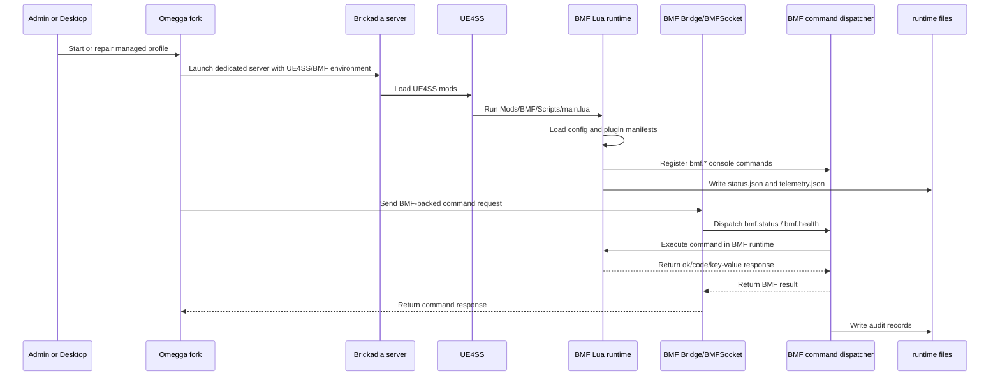
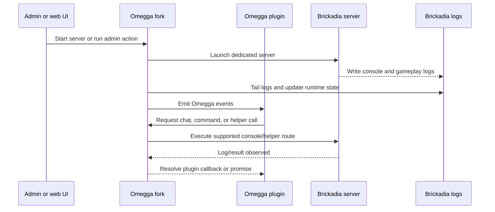
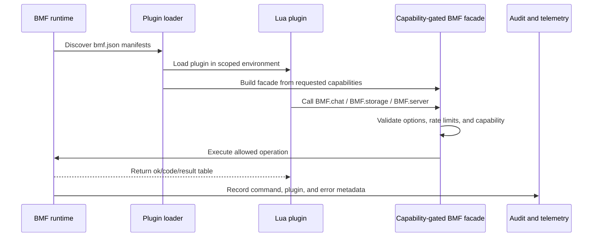
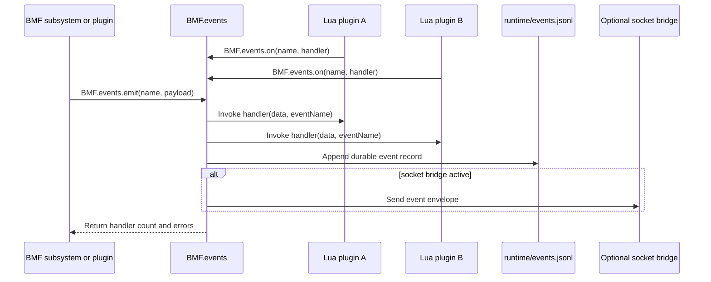
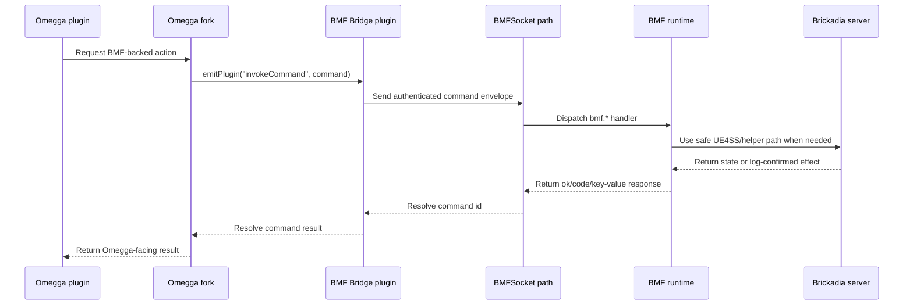
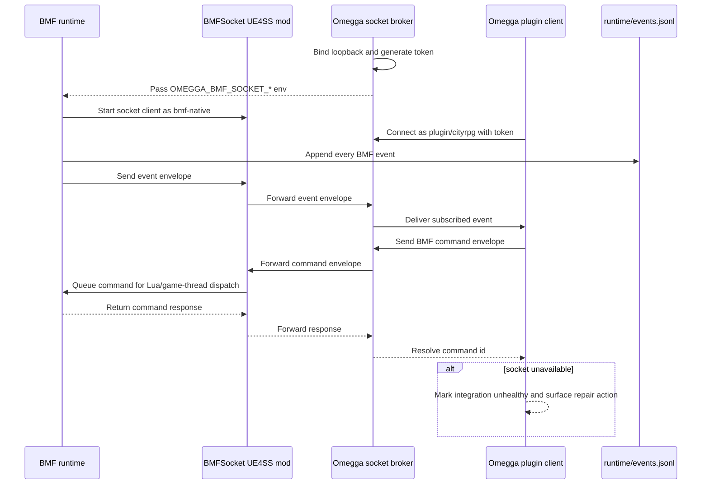
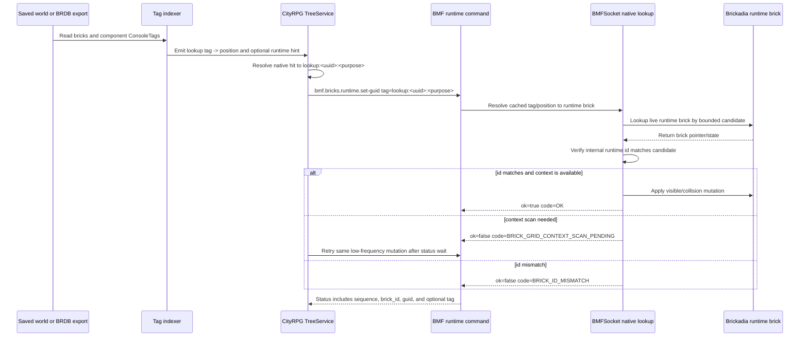
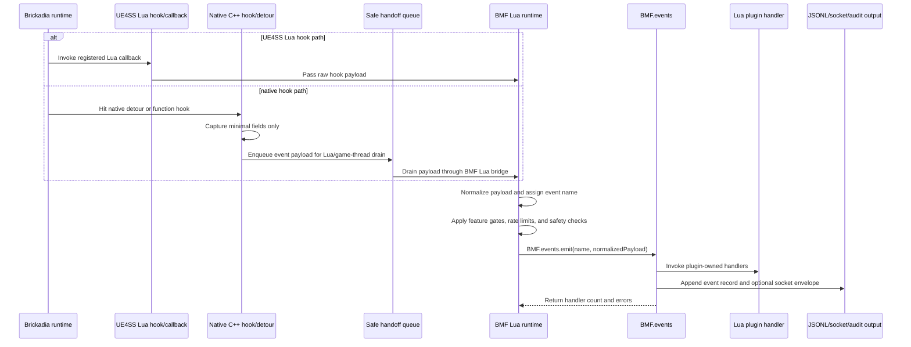
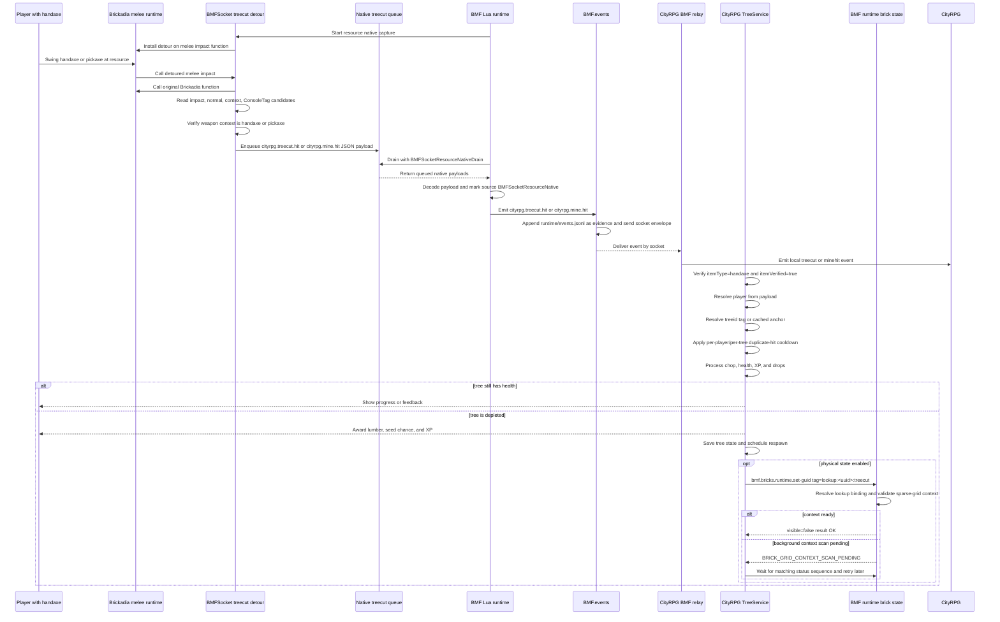

# Architecture Patterns

These proposed patterns are a critique surface for the BMF/Omegga architecture.
They are intentionally high level: enough to show ownership, message flow, and
trust boundaries without repeating every API detail.

## Who Should Read This?

Architects should use this page to challenge ownership and trust boundaries.
BMF maintainers should use it when deciding where a capability belongs. Plugin
authors and Omegga integrators should use it to understand which side owns a
message, command, or hook.

Use this page when reviewing whether a capability should live in BMF, in the
BMF-supported Omegga fork, in a Lua plugin, or in an external Omegga plugin.

## 1. Required BMF Runtime Stack

BMF's supported Windows runtime requires the BMF-supported Omegga Windows fork.
Omegga owns the server supervisor, UE4SS compatibility setup, command bridge,
log context, player sync, and helper surfaces that BMF depends on for current
canaries and live-player APIs. BMF owns the UE4SS Lua runtime, plugin loader,
capability gates, runtime files, and BMF API contracts.

Review questions:

- Which responsibilities are Omegga runtime requirements today?
- Which runtime files are stable contracts versus diagnostics?
- Which command handlers cross onto the game thread?

## 2. Omegga Fork On Its Own

The BMF-supported Omegga fork is still an Omegga server supervisor. Without BMF
participating, it starts Brickadia, reads logs, manages plugins, exposes web/UI
surfaces, and sends supported console/helper commands.

Review questions:

- Which Omegga behaviors are generic upstream behavior?
- Which behaviors are fork-specific Windows/UE4SS compatibility shims?
- Which plugin APIs depend on logs instead of direct server state?

## 3. BMF With Lua Plugins

BMF Lua plugins are in-process server-side extensions. They should use the
capability-gated BMF facade instead of reaching directly into globals or native
helpers.

Review questions:

- Are capability names specific enough for review?
- Should a plugin receive a direct mutating API or a queued command API?
- What gets cleaned up automatically on plugin reload?

## 4. BMF Event Bus With Lua Plugins

The BMF event bus is the in-process coordination path. It lets framework code
and Lua plugins share events without forcing every plugin to poll files or logs.

Review questions:

- Which events are framework contracts versus plugin-local conventions?
- Do event handlers need allow/deny semantics or report-only semantics?
- Which events must also leave an audit trail outside the process?

## 5. BMF And Omegga Fork For Basic Omegga Functionality

For basic Omegga functionality, the fork stays the supervisor and transport
owner. BMF provides the server-side command/API implementation when the action
needs UE4SS or Brickadia-specific access.

Review questions:

- Which layer owns retry behavior?
- Which layer converts BMF result fields into Omegga plugin errors?
- Which operations should remain Omegga-only instead of routing through BMF?

## 6. BMF And Omegga Event Bus Messaging

For low-latency messaging between in-process BMF and external Omegga plugins,
the supported fork starts an authenticated loopback socket broker. The JSONL
event file remains durable diagnostic and audit evidence.

Review questions:

- Which messages require socket latency, and what repair action should surface
  when the socket is unavailable?
- Where should authentication, replay protection, and backpressure live?
- Are event names stable enough for external plugins to depend on?

## 7. Brick Lookup With ConsoleTag

`ConsoleTag` should be treated as a stable logical identity, not as a magic live
pointer. Current safe patterns expose `lookup:<uuid>:<purpose>` to scripters,
then let BMF use existing bindings, explicit positions, or the native target
cache to find and validate the live runtime brick before mutation.

Review questions:

- What produces the trusted tag index for a given server?
- When should saved `brickIndex` be rejected as a runtime id candidate?
- How fresh does the bounded native target cache need to be for UUID-first
  resource lookup without adding game-thread scan risk?

## 8. Hooked Brickadia Events Into Lua

BMF gets gameplay events into Lua through a small number of hook ingress paths.
The key architectural rule is that hooks should capture the minimum Brickadia
state needed, then hand a normalized event to BMF Lua. Lua owns policy,
capability checks, event naming, plugin dispatch, and audit output.

Review questions:

- Which hook paths are safe to call Lua directly, and which must queue first?
- What is the minimal payload each hook should capture before returning?
- Which layer owns policy decisions: the hook, BMF normalization, or plugins?
- How are duplicate native callbacks coalesced before they become gameplay
  events?

## 9. CityRPG Native Tree Cutting

Tree cutting is the current concrete example of the hook-ingress pattern. BMF
does not get this event from Omegga logs first. It captures the Brickadia melee
impact in native code, drains the native queue into BMF Lua, emits a BMF event,
and lets CityRPG consume that event over the socket.

Review questions:

- Should BMF emit a more generic event than `cityrpg.treecut.hit` before
  CityRPG-specific naming?
- Which fields in the native payload are stable enough to document as a
  contract?
- Where should duplicate-hit coalescing live: native queue, BMF Lua, or
  CityRPG?
- Should physical hide/restore be part of tree-cut handling, or a separate
  resource-node lifecycle pattern?

## Consolidation Rule

Detailed API pages should document exact parameters, flags, and validation
levels. This page should own the high-level flow explanations. If another doc
starts re-explaining one of these flows in prose, link back here and keep the
local text focused on the command or configuration at hand.
