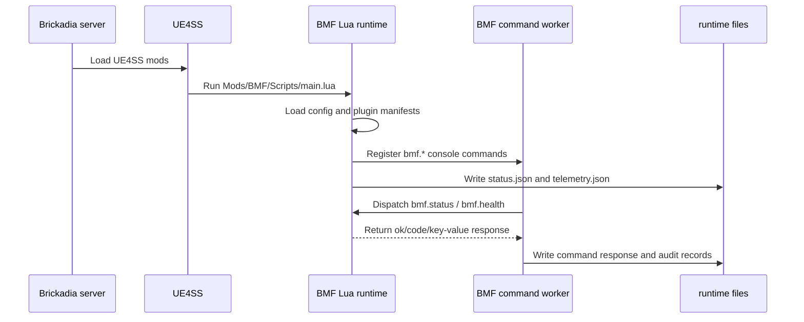
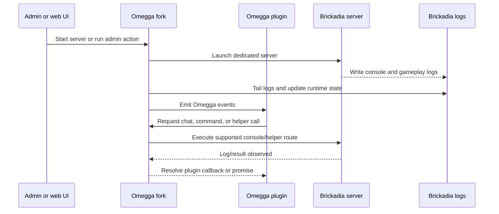
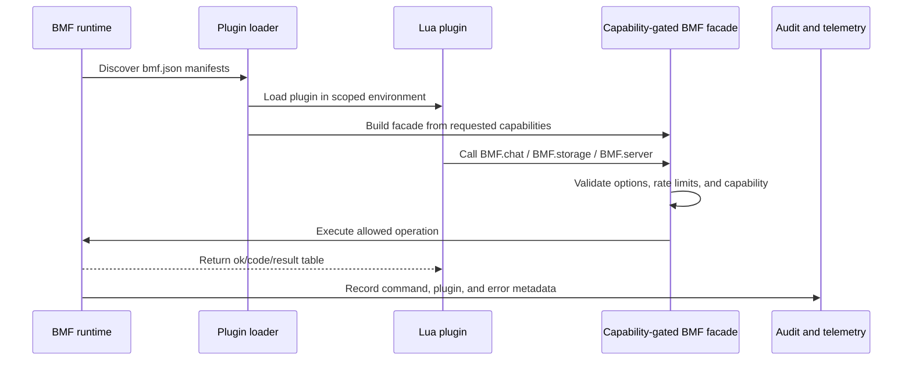
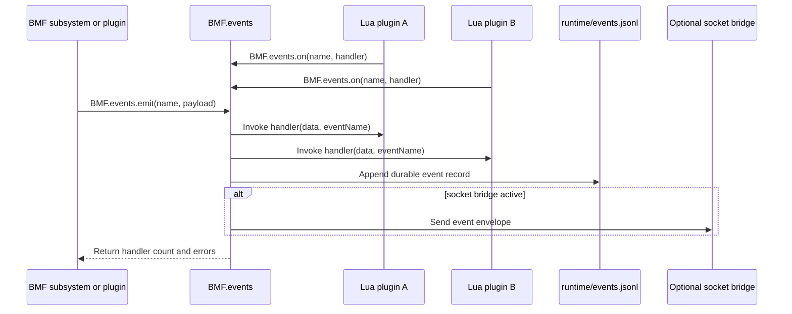
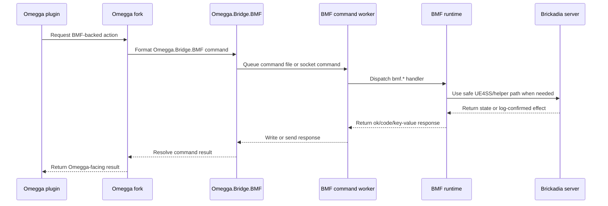
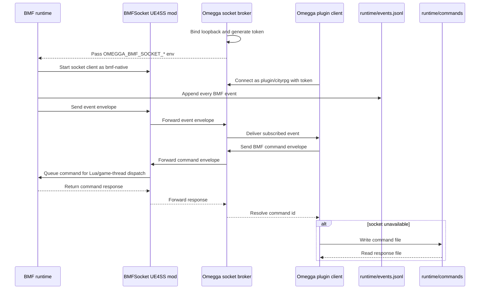
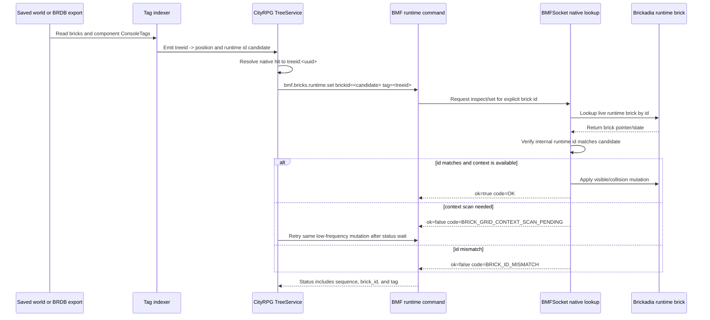
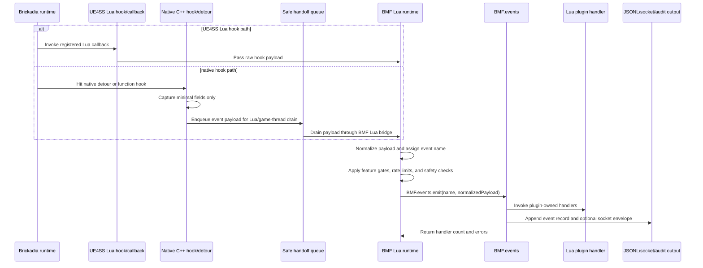

# Proposed Patterns

These diagrams are a critique surface for the BMF/Omegga architecture. They are
intentionally high level: enough to show ownership, message flow, and trust
boundaries without repeating every API detail.

Use this page when reviewing whether a capability should live in BMF, in the
BMF-supported Omegga fork, in a Lua plugin, or in an external Omegga plugin.

## 1. BMF On Its Own

BMF can run inside a UE4SS-enabled Brickadia server without Omegga. In this
mode, BMF owns Lua bootstrap, plugin loading, command registration, runtime
files, and audit/telemetry output.

Review questions:

- Which features still require Omegga when BMF runs standalone?
- Which runtime files are stable contracts versus diagnostics?
- Which command handlers cross onto the game thread?

## 2. Omegga Fork On Its Own

The BMF-supported Omegga fork is still an Omegga server supervisor. Without BMF
participating, it starts Brickadia, reads logs, manages plugins, exposes web/UI
surfaces, and sends supported console/helper commands.

Review questions:

- Which Omegga behaviors are generic upstream behavior?
- Which behaviors are fork-specific Windows/UE4SS compatibility shims?
- Which plugin APIs depend on logs instead of direct server state?

## 3. BMF With Lua Plugins

BMF Lua plugins are in-process server-side extensions. They should use the
capability-gated BMF facade instead of reaching directly into globals or native
helpers.

Review questions:

- Are capability names specific enough for review?
- Should a plugin receive a direct mutating API or a queued command API?
- What gets cleaned up automatically on plugin reload?

## 4. BMF Event Bus With Lua Plugins

The BMF event bus is the in-process coordination path. It lets framework code
and Lua plugins share events without forcing every plugin to poll files or logs.

Review questions:

- Which events are framework contracts versus plugin-local conventions?
- Do event handlers need allow/deny semantics or report-only semantics?
- Which events must also leave an audit trail outside the process?

## 5. BMF And Omegga Fork For Basic Omegga Functionality

For basic Omegga functionality, the fork stays the supervisor and transport
owner. BMF provides the server-side command/API implementation when the action
needs UE4SS or Brickadia-specific access.

Review questions:

- Which layer owns retry behavior?
- Which layer converts BMF result fields into Omegga plugin errors?
- Which operations should remain Omegga-only instead of routing through BMF?

## 6. BMF And Omegga Event Bus Messaging

For low-latency messaging between in-process BMF and external Omegga plugins,
the supported fork starts an authenticated loopback socket broker. The JSONL
event file remains the durable fallback and audit trail.

Review questions:

- Which messages require socket latency, and which can use file fallback?
- Where should authentication, replay protection, and backpressure live?
- Are event names stable enough for external plugins to depend on?

## 7. Brick Lookup With ConsoleTag

`ConsoleTag` should be treated as a stable logical identity, not as a magic live
pointer. Current safe patterns use the tag to find or confirm a candidate
runtime brick id, then let BMF native code validate that candidate before
mutation.

Review questions:

- What produces the trusted tag index for a given server?
- When should saved `brickIndex` be rejected as a runtime id candidate?
- Is a future tag-only resolver worth the game-thread scan risk?

## 8. Hooked Brickadia Events Into Lua

BMF gets gameplay events into Lua through a small number of hook ingress paths.
The key architectural rule is that hooks should capture the minimum Brickadia
state needed, then hand a normalized event to BMF Lua. Lua owns policy,
capability checks, event naming, plugin dispatch, and audit output.

Review questions:

- Which hook paths are safe to call Lua directly, and which must queue first?
- What is the minimal payload each hook should capture before returning?
- Which layer owns policy decisions: the hook, BMF normalization, or plugins?
- How are duplicate native callbacks coalesced before they become gameplay
  events?

## Consolidation Rule

Detailed API pages should document exact parameters, flags, and validation
levels. This page should own the high-level flow explanations. If another doc
starts re-explaining one of these flows in prose, link back here and keep the
local text focused on the command or configuration at hand.
